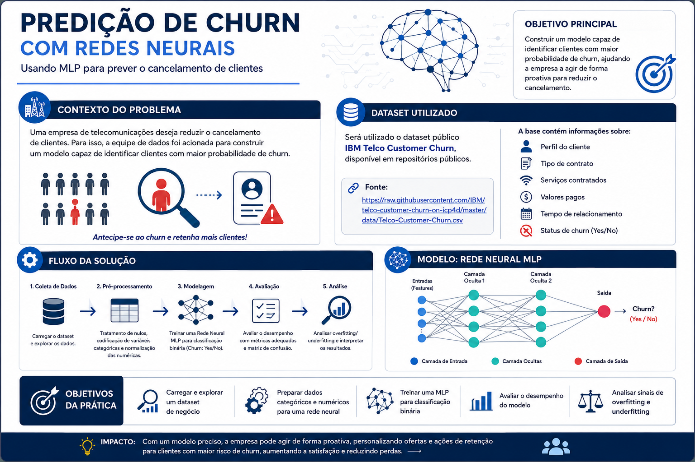

# Tarefa 01 — Predição de Churn com Redes Neurais

Atividade prática da disciplina **Arquiteturas de Deep Learning** — PUC Minas.



---

## Contexto do Problema

Uma empresa de telecomunicações deseja reduzir o cancelamento de clientes. Para isso, a equipe de dados foi acionada para construir um modelo capaz de identificar clientes com maior probabilidade de **churn**.

Nesta atividade, treinamos uma rede neural **MLP** para prever se um cliente irá cancelar ou permanecer na empresa.

---

## Dataset

**IBM Telco Customer Churn** — dataset público disponível em:  
https://raw.githubusercontent.com/IBM/telco-customer-churn-on-icp4d/master/data/Telco-Customer-Churn.csv

A base contém informações sobre:

- perfil do cliente
- tipo de contrato
- serviços contratados
- valores pagos
- tempo de relacionamento
- status de churn

| Campo | Detalhe |
|:------|:--------|
| Arquivo | `Telco-Customer-Churn.csv` |
| Linhas | 7.043 clientes |
| Features | 20 atributos |
| Target | `Churn` (Sim / Não) |

---

## Objetivos da Prática

Ao final da atividade, você será capaz de:

- carregar e explorar um dataset de negócio
- preparar dados categóricos e numéricos para uma rede neural
- treinar uma MLP para classificação binária
- avaliar o desempenho do modelo
- analisar sinais de overfitting e underfitting

---

## Conteúdo

```
Tarefa_01/
├── churn_mlp.ipynb                  # Notebook principal
├── Telco-Customer-Churn.csv         # Dataset
├── predicao_churn_redes_neurais.png # Imagem de capa
└── README.md
```

---

## Como executar

```bash
pip install torch numpy pandas matplotlib seaborn scikit-learn jupyter
jupyter notebook churn_mlp.ipynb
```
