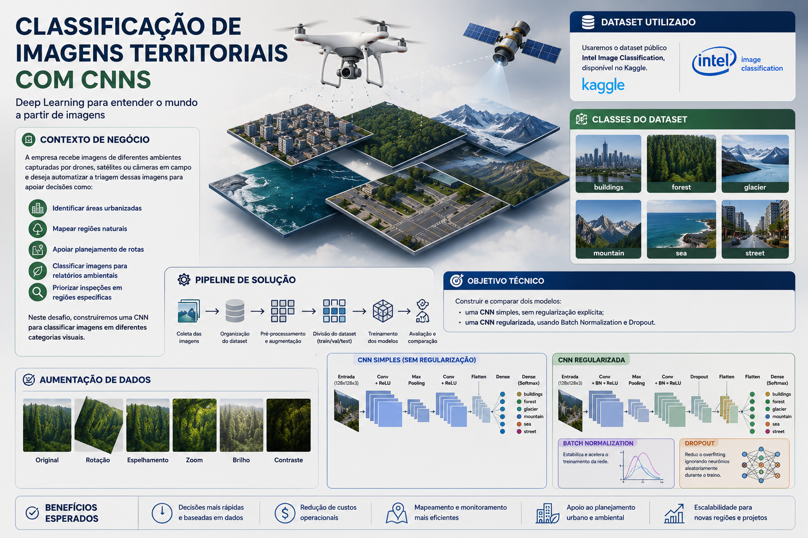

# Tarefa 02 — Classificação de Imagens Territoriais com CNNs

Atividade prática da disciplina **Arquiteturas de Deep Learning** — PUC Minas.



---

## Contexto de Negócio

Uma empresa que atua com monitoramento territorial, logística, infraestrutura e planejamento urbano recebe imagens de diferentes ambientes capturadas por drones, satélites ou câmeras em campo.

A empresa deseja automatizar a triagem dessas imagens para apoiar decisões como:

- identificar áreas urbanizadas
- mapear regiões naturais
- apoiar planejamento de rotas
- classificar imagens para relatórios ambientais
- priorizar inspeções em regiões específicas

Neste desafio, construiremos uma **CNN** para classificar imagens em diferentes categorias visuais.

---

## Dataset

**Intel Image Classification** — disponível no Kaggle:  
https://www.kaggle.com/datasets/puneet6060/intel-image-classification

Classes do dataset:

- `buildings`
- `forest`
- `glacier`
- `mountain`
- `sea`
- `street`

| Campo | Detalhe |
|:------|:--------|
| Imagens de treino | 14.034 |
| Imagens de teste | 3.000 |
| Imagens para predição | 7.301 (sem rótulo) |

> **O dataset de imagens não está incluído neste repositório (~370 MB).**  
> Faça o download no link acima e extraia na estrutura abaixo antes de rodar o notebook.

### Estrutura esperada do dataset

```
Tarefa_02/
├── seg_train/seg_train/
│   ├── buildings/ │ forest/ │ glacier/ │ mountain/ │ sea/ │ street/
├── seg_test/seg_test/
│   └── (mesmas 6 classes)
├── seg_pred/seg_pred/
│   └── (imagens sem rótulo)
├── classificacao_imagens_territoriais_cnn.ipynb
└── README.md
```

---

## Objetivo Técnico

Construir e comparar dois modelos:

1. **CNN simples** — sem regularização explícita
2. **CNN regularizada** — usando:
   - Batch Normalization
   - Dropout

---

## Conteúdo

```
Tarefa_02/
├── classificacao_imagens_territoriais_cnn.ipynb     # Notebook principal
├── classificacao_imagens_territoriais.png           # Imagem de capa
└── README.md
```

---

## Como executar

```bash
pip install tensorflow numpy pandas matplotlib seaborn scikit-learn jupyter
jupyter notebook classificacao_imagens_territoriais_cnn.ipynb
```

> Recomendado: **Python 3.10 ou 3.11** para melhor compatibilidade com TensorFlow no Windows.
